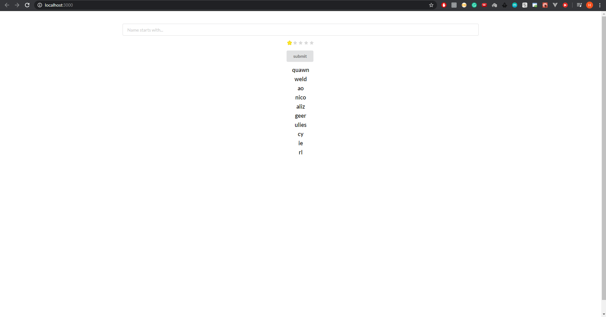
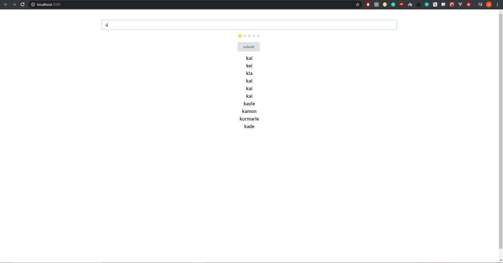

# Deep Learning Names Generator

Created Flask Api that talks to the Deep Learning Algorithm and generate names. For the Interface I used the React.js framework. This React.js interface talks to the flask api to get the data from the server. 

## Here are some Screenshots: 

### 1) Basic First Page. It shows Random Names

### 2) Names Generation.

